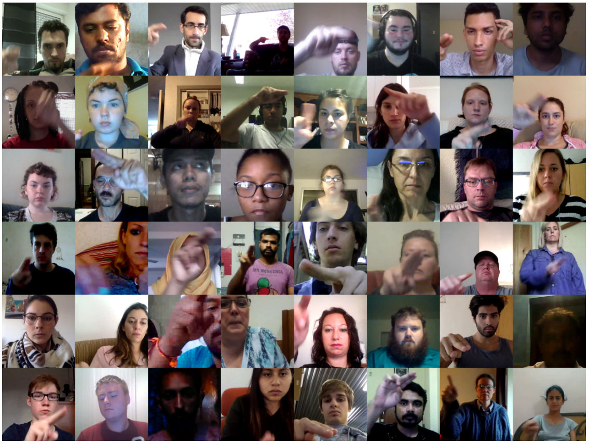
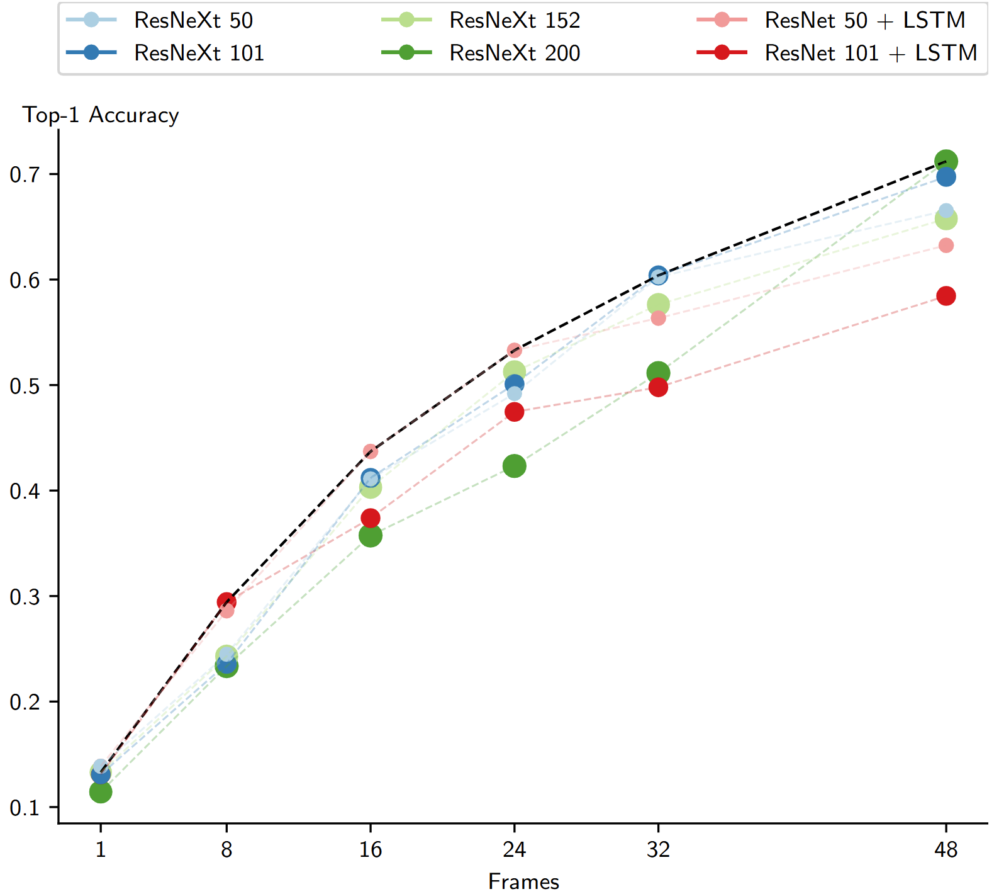

<section class="hero">
  

    <h6 class="subtitle has-text-centered">
        Note: This is an unofficial project page. The official dataset can be found <a href="https://www.qualcomm.com/developer/software/airletters-dataset">here</a>. 
    </h6>
    <h4 class="subtitle has-text-centered">
        AirLetters is a new video dataset consisting of real-world videos of human-generated, articulated motions.
    </h4>
    <video poster="" id="steve" autoplay muted loop playsinline style="margin: 0 auto; display: block; max-width: 100%; height: auto;">
      <source src="../assets/img/airletters/con.mp4" type="video/mp4">
    </video>
  

</section> 

    

        <h2>Abstract</h2>
        

We introduce AirLetters, a new video dataset consisting of real-world videos of human-generated, articulated motions. Specifically, our dataset requires a vision model to predict letters that humans draw in the air. Unlike existing video datasets, accurate classification predictions for AirLetters rely critically on discerning motion patterns and on integrating long-range information in the video over time. An extensive evaluation of state-of-the-art image and video understanding models on AirLetters shows that these methods perform poorly and fall far behind a human baseline. Our work shows that, despite recent progress in end-to-end video understanding, accurate representations of complex articulated motions – a task that is trivial for humans – remains an open problem for end-to-end learning.
        

    

---

<h2 id="motivation">Motivation</h2>

- We highlight a significant gap in current end-to-end video understanding and activity recognition methods: all models, especially large vision language models, perform well below human evaluation results. Human evaluation achieves near-perfect accuracy, while the task is challenging for all tested models. Unlike existing video datasets, accurate video understanding on our dataset requires detailed understanding of motion in the video and the integration of long-range temporal information across the entire video.
- This dataset requires models to attend through the entire video to perform well, and increasing the number of frames that models attend to significantly increases their performance.
- We show that classes such as the digits “0”, “1”, and “2” are particularly challenging, as they are easily confused with each other. In contrast, the contrast classes “Doing Nothing” and “Doing Other Things”, are more easily recognized which demonstrates the challenging nature of understanding precise motions for video understanding models.

<h2 id="contents">Dataset Contents</h2>

We focus on manual articulations of each letter of the Latin alphabet as well as numeric digits. This amounts to 36 primary gesture classes, for which recognition requires temporal and spatial analysis of the video. The dataset also includes two contrast classes designed to refine the sensitivity and specificity of recognition systems trained on our dataset. The “Doing Nothing” class includes videos of individuals in non-active states, such as sitting or standing still, to represent periods of inactivity within human-computer interactions, and the “Doing Other Things” class consists of clips capturing miscellaneous, non-communicative movements such as adjusting position or random hand movements.

  
  
Figure: <b>Diversity in our Dataset.</b> Each of the images is taken from a randomly sampled video from our dataset. Our dataset has a large variance in the appearance of subjects, background, occlusion, and lighting conditions in the videos.

Our dataset has videos with precise articulated motion across many different frames instead of many other dataset which only need 1 frame or 2-4 frames to understand the video.

  
  
Figure: <b>Challenges due to inter-class similarities and intra-class diversity.</b> We show some examples of drawing the letter “B” and the digit of “3”, where differentiating both of these classes also requires understanding depth and velocity of relative motion to understand if the individual intended to draw a vertical line (for “B”) or only meant to place their hands in position (for “3”). Underneath, we show examples of variability in drawing the letter “Y”. For example, in one way version of drawing the letter “Y”, only the last few frames show a stroke that distinguishes it from the letter “X”.

Choosing a few key frames in our dataset does not help in understanding the video, and the entire video needs to be considered to understand the motion.

  
  
Figure: <b>Scaling Training Frames.</b> Performance of models across different numbers of training frames. The Pareto Frontier is represented by a black curve. Note that this dataset requires models to attend through the entire video to perform well, and increasing the number of frames that models attend to significantly increases their performance.

<h2 id="stats">Dataset Statistics</h2>

<table>
    <thead>
        <tr>
            <th>Statistic</th>
            <th>Value</th>
        </tr>
    </thead>
    <tbody>
        <!-- Total Statistics -->
        <tr class="section-header">
            <td colspan="2">Total Statistics</td>
        </tr>
        <tr><td class="subsection">Videos</td><td>161,652</td></tr>
<tr><td class="subsection" style="padding-left: 36px;">Training Split</td><td>128,745</td></tr>
<tr><td class="subsection" style="padding-left: 36px;">Validation Split</td><td>16,480</td></tr>
<tr><td class="subsection" style="padding-left: 36px;">Test Split</td><td>16,427</td></tr>
        <tr><td class="subsection">Classes</td><td>38</td></tr>
        <tr><td class="subsection">Actors</td><td>1,781</td></tr>
        <tr><td class="subsection">Frames</td><td>40,142,100</td></tr>
        
        <!-- Median Statistics -->
        <tr class="section-header">
            <td colspan="2">Median Statistics (with Standard Deviation)</td>
        </tr>
        <tr><td class="subsection">Duration</td><td>2.93 (±0.13)</td></tr>
        <tr><td class="subsection">FPS</td><td>30.0 (±0.0)</td></tr>
        <tr><td class="subsection">Videos per Class (×10³)</td><td>4.04 (±1.31)</td></tr>
        <tr><td class="subsection">Videos per Actor</td><td>40.0 (±99.29)</td></tr>
    </tbody>
</table>

<h2 id="citation">Citation</h2>

  <pre><code id="citationCode">
@inproceedings{dagliairletters,
    title={AirLetters: An Open Video Dataset of Characters Drawn in the Air},
    author={Dagli, Rishit and Berger, Guillaume and Materzynska, Joanna and Bax, Ingo and Memisevic, Roland},
    booktitle={European Conference on Computer Vision Workshops},
    year={2024}
}</code></pre>
  <button class="button is-small is-dark" onclick="copyCitation()" style="position: absolute; top: 10px; right: 10px;">
    
      <i class="fas fa-copy"></i>
    
  </button>

