---

<div id="loading">
  <div class="loader"></div>
  <!--  -->
</div>
<section class="hero teaser">
  <div class="container is-max-desktop">
    <div class="hero-body">
      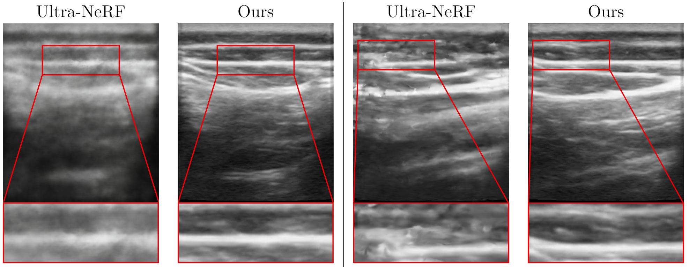
      <h5 class="subtitle has-text-centered">
        <span class="dnerf">NeRF-US</span> turns ultrasounds captured in the wild into artifact-free 3D reconstructions.
      </h5>
    </div>
  </div>
</section>

<section class="hero is-light is-small">
  <div class="hero-body">
    <div class="container">
      <div id="results-carousel" class="carousel results-carousel">
        <div class="item item-steve">
          <video poster="" id="steve" autoplay controls muted loop playsinline height="100%">
            <source src="../assets/img/nerf-us/results/converted_0.mp4"
                    type="video/mp4">
          </video>
        </div>
        <div class="item item-chair-tp">
          <video poster="" id="chair-tp" autoplay controls muted loop playsinline height="100%">
            <source src="../assets/img/nerf-us/results/converted_1.mp4"
                    type="video/mp4">
          </video>
        </div>
        <div class="item item-shiba">
          <video poster="" id="shiba" autoplay controls muted loop playsinline height="100%">
            <source src="../assets/img/nerf-us/results/converted_2.mp4"
                    type="video/mp4">
          </video>
        </div>
        <div class="item item-fullbody">
          <video poster="" id="fullbody" autoplay controls muted loop playsinline height="100%">
            <source src="../assets/img/nerf-us/results/converted_3.mp4"
                    type="video/mp4">
          </video>
        </div>
        <div class="item item-blueshirt">
          <video poster="" id="blueshirt" autoplay controls muted loop playsinline height="100%">
            <source src="../assets/img/nerf-us/results/converted_4.mp4"
                    type="video/mp4">
          </video>
        </div>
        <div class="item item-mask">
          <video poster="" id="mask" autoplay controls muted loop playsinline height="100%">
            <source src="../assets/img/nerf-us/results/converted_5.mp4"
                    type="video/mp4">
          </video>
        </div>
      </div>
    </div>
  </div>
  <h5 class="subtitle has-text-centered">
    Novel view ultrasound renders from <span class="dnerf">NeRF-US</span>.
  </h5>
</section>
<br/>

<div class="columns is-centered has-text-centered">
    <div class="column is-four-fifths">
        <h2>Abstract</h2>
        <div class="content has-text-justified">
The "computable" numbers may be described briefly as the real
numbers whose expressions as a decimal are calculable by finite means.
Although the subject of this paper is ostensibly the computable numbers.
it is almost equally easy to define and investigate computable functions
of an integral variable or a real or computable variable, computable
predicates, and so forth. The fundamental problems involved are,
however, the same in each case, and I have chosen the computable numbers
for explicit treatment as involving the least cumbrous technique. I hope
shortly to give an account of the relations of the computable numbers,
functions, and so forth to one another. This will include a development
of the theory of functions of a real variable expressed in terms of computable
numbers. According to my definition, a number is computable
if its decimal can be written down by a machine...
        </div>
    </div>
</div>

---

<h2 id="motivation">Motivation</h2>

<table style="width: 100%; border-collapse: collapse;">
  <tr>
    <td style="padding-right: 8px; text-align: left;">There are a few challenges common when using previous medical NeRF methods and standard methods: the need for high-quality, diverse datasets, capturing intricate details like <span style="color:red">tissue interface locations</span> critical for medical diagnosis, accurately modeling transparent and reflective surfaces. There are quite a few <span style="color:red">NeRF artifacts</span> that appear when using these methods in the wild. In contrast to this, our approach (as shown) produces artifact-free reconstructions with minor details accurately reconstructed.</td>
    <td style="padding-left: 8px; text-align: right;">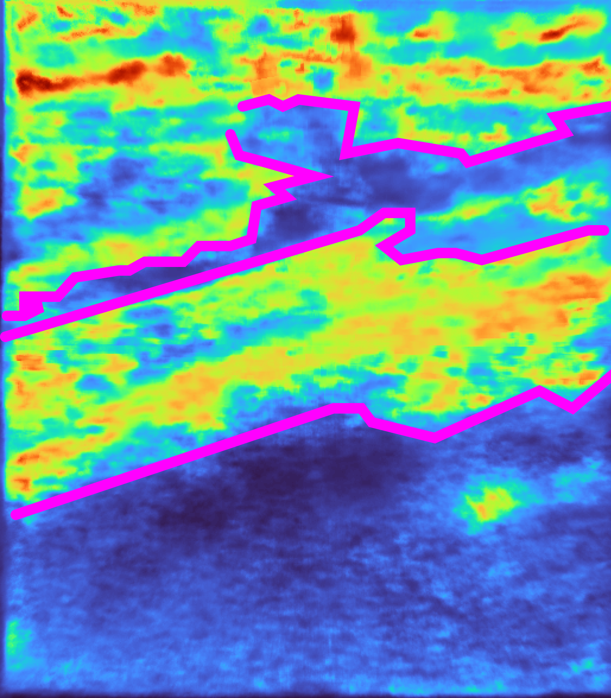</td>
  </tr>
</table>

<h2>How does <span class="dnerf">NeRF-US</span> work?</h2>

Our goal is to produce a 3D representation given a set of ultrasound images taken in the wild and their camera positions. The first step of our approach relies on the training of a <span style="color:red">3D diffusion model</span>, which can serve as geometric priors for our NeRF model. This diffusion model produces an 32 x 32 x 32 occupancy grid. To create this diffusion model, we finetune the 3D diffusion model on a small dataset of voxels around the human knee generated synthetically.

<div class="content has-text-justified">
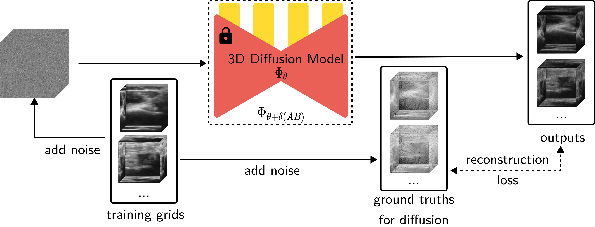
<p>Figure: An overview of how our diffusion model is fine-tuned, we use 32<sup>3</sup>-sized patches to LoRA-finetune a 3D diffusion model trained on ShapeNet.</p>

We now train our NeRF model that takes in a 3D vector (denoting positions in 3D) and learns a 5D vector (attenuation, reflectance, border probabiltiy, scattering density, and scattering intensity). While training this NeRF, we run the outputs through the diffusion model and obtain <span style="color:red">guidance vectors</span> for <span style="color:red">border probability</span> and <span style="color:red">scattering density</span>. These are added to the photometric loss. We finally train the NeRF with this final loss we calculated.

<div class="content has-text-justified">
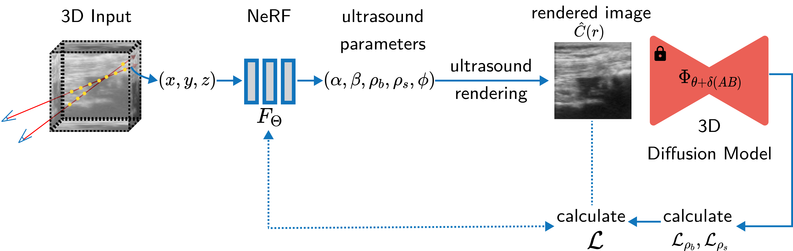
<p>Figure: An overview of how our method works. We train a NeRF model that uses ultrasound rendering to convert the representations into a 2D image after which we infer through a 3D diffusion model which has geometry priors through which we calculate a modified loss definition to train the NeRF.</p>

<h2 id="visual-results">Visual Results</h2>

<section class="section">
<div class="container is-max-desktop ">
  <div class=" has-text-centered">
    <div class="columns is-centered">
      <div class="column">
        <div class="content">
          <div class="columns is-centered">
            <div class="column is-full-width">
              <div id="example1" class="bal-container-small">

                <div class="bal-after">
                  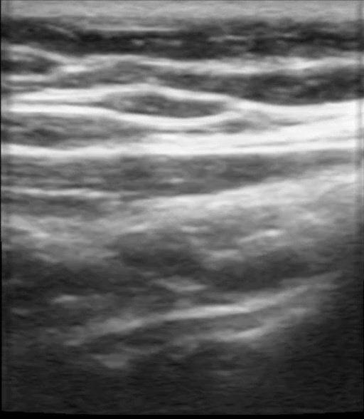
                  <div class="bal-afterPosition afterLabel" style="z-index:1;">
                    Ours
                  </div>
                </div>

                <div class="bal-before" style="width:96.4968152866242%;">
                  <div class="bal-before-inset" style="width: 512px;">
                    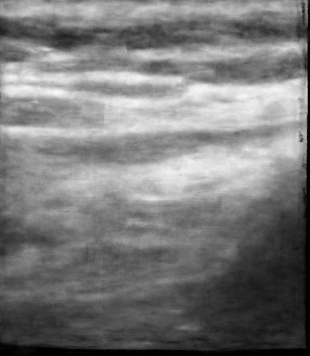
                    <div class="bal-beforePosition beforeLabel">
                      Nerfacto [Tancik 2023]
                    </div>
                  </div>
                </div>

                <div class="bal-handle" style="left:96.4968152866242%;">
                  <span class=" handle-left-arrow"></span>
                  <span class="handle-right-arrow"></span>
                </div>

              </div>


              <div id="example2" class="bal-container-small">

                <div class="bal-after">
                  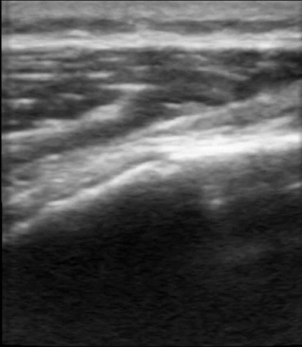
                  <div class="bal-afterPosition afterLabel">
                    Ours
                  </div>
                </div>

                <div class="bal-before" style="width: 50%;">
                  <div class="bal-before-inset" style="width: 512px;">
                    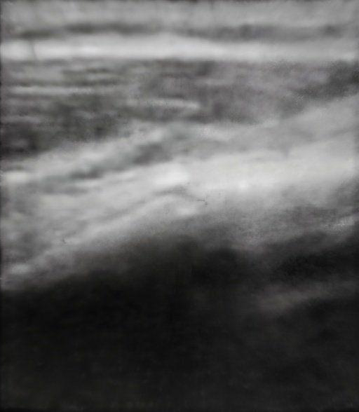
                    <div class="bal-beforePosition beforeLabel">
                      Nerfacto [Tancik 2023]
                    </div>
                  </div>
                </div>

                <div class="bal-handle" style="left: 50%;">
                  <span class=" handle-left-arrow"></span>
                  <span class="handle-right-arrow"></span>
                </div>
              </div>
              <div id="example3" class="bal-container-small">

                <div class="bal-after">
                  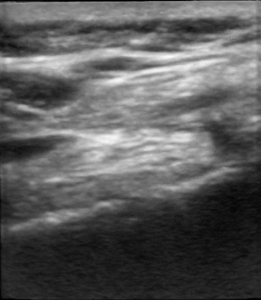
                  <div class="bal-afterPosition afterLabel">
                    Ours
                  </div>
                </div>

                <div class="bal-before" style="width: 50%;">
                  <div class="bal-before-inset" style="width: 512px;">
                    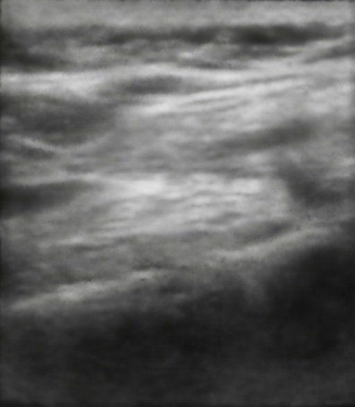
                    <div class="bal-beforePosition beforeLabel">
                      Nerfacto [Tancik 2023]
                    </div>
                  </div>
                </div>

                <div class="bal-handle" style="left: 50%;">
                  <span class=" handle-left-arrow"></span>
                  <span class="handle-right-arrow"></span>
                </div>
              </div>

            </div>
          </div>
        </div>
      </div>
      <div class="column">
        <div class="columns is-centered">
          <div class="column content">

            <div id="example4" class="bal-container-small">
              <div class="bal-after">
                
                <div class="bal-afterPosition afterLabel" style="z-index:1;">
                  Ours
                </div>
              </div>

              <div class="bal-before" style="width:62.10191082802548%;">
                <div class="bal-before-inset" style="width: 512px;">
                  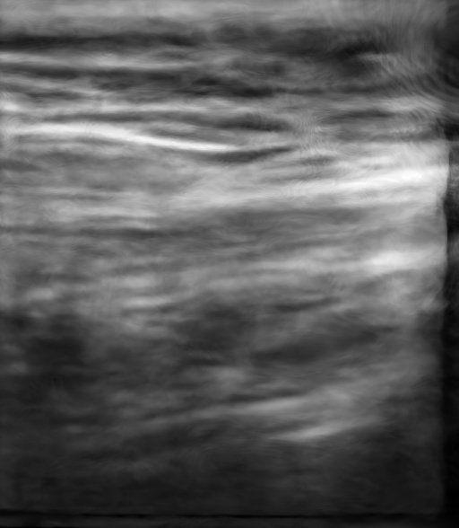
                  <div class="bal-beforePosition beforeLabel">
                    Ultra-NeRF [Wysocki 2024]
                  </div>
                </div>
              </div>

              <div class="bal-handle" style="left:62.10191082802548%;">
                <span class=" handle-left-arrow"></span>
                <span class="handle-right-arrow"></span>
              </div>

            </div>

            <div id="example5" class="bal-container-small">
              <div class="bal-after">
                
                <div class="bal-afterPosition afterLabel" style="z-index:1;">
                  Ours
                </div>
              </div>

              <div class="bal-before" style="width:56.77179962894249%;">
                <div class="bal-before-inset" style="width: 512px;">
                  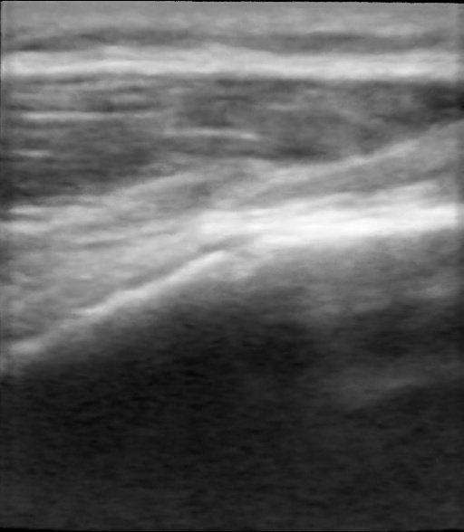
                  <div class="bal-beforePosition beforeLabel">
                    Ultra-NeRF [Wysocki 2024]
                  </div>
                </div>
              </div>

              <div class="bal-handle" style="left:56.77179962894249%;">
                <span class=" handle-left-arrow"></span>
                <span class="handle-right-arrow"></span>
              </div>

            </div>
            <div id="example6" class="bal-container-small">
              <div class="bal-after">
                
                <div class="bal-afterPosition afterLabel" style="z-index:1;">
                  Ours
                </div>
              </div>

              <div class="bal-before" style="width:56.77179962894249%;">
                <div class="bal-before-inset" style="width: 512px;">
                  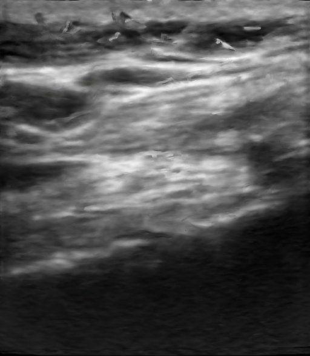
                  <div class="bal-beforePosition beforeLabel">
                    Ultra-NeRF [Wysocki 2024]
                  </div>
                </div>
              </div>

              <div class="bal-handle" style="left:56.77179962894249%;">
                <span class=" handle-left-arrow"></span>
                <span class="handle-right-arrow"></span>
              </div>
            </div>
          </div>
        </div>
      </div>
    </div>
  </div>
  </div>
</section>
  <script>
    new BeforeAfter({
      id: '#example1'
    });
    new BeforeAfter({
      id: '#example2'
    });
    new BeforeAfter({
      id: '#example3'
    });
    new BeforeAfter({
      id: '#example4'
    });
    new BeforeAfter({
      id: '#example5'
    });
    new BeforeAfter({
      id: '#example6'
    });
  </script>

<div class="content has-text-justified">
  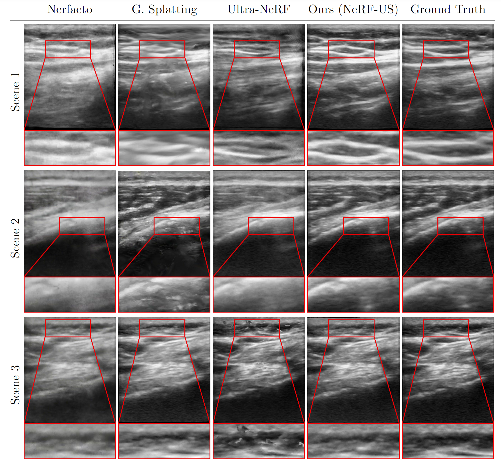
  <p>Figure: <b>Qualitative Results.</b> We demonstrate the results of our method and compare it qualitatively with Nerfacto [1], Gaussian Splatting [3], and Ultra-NeRF [2]. Our approach, NeRF-US, produces accurate and high-quality reconstructions as compared to the baseline models on novel views (<b>best viewed with zoom</b>).</p>
</div>

<div class="content has-text-justified">
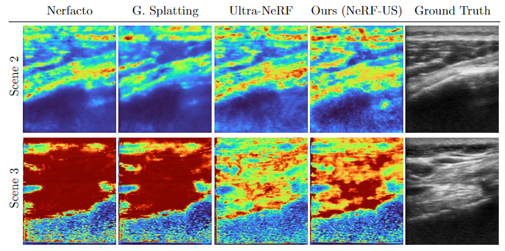
<p>Figure: <b>Qualitative Results.</b> We demonstrate the results of depth maps produced from our method and compare them qualitatively with Nerfacto [1], Gaussian Splatting [3], and Ultra-NeRF [2] (<b>best viewed in color and with zoom</b>).</p>

</div>
<script>
  $(window).on('load', function () {
    $('#loading').hide();
  })
</script>

<h2 id="ultrasound-in-the-wild-dataset">Ultrasound in the wild Dataset</h2>

Here we show some instances of our new ultrasound in the wild dataset, we limit the visualizations of the dataset to the first 10 seconds of some of the scenes in our dataset. For visualization, we pre-process these videos with a script.

<div class="content">
  <button class="button is-black is-block" onclick="toggleCodeBlock()">Show pre-processing script</button>
  <div id="bashCodeBlock" style="display: none;">
    <pre><code class="language-bash">#!/bin/bash

TARGET_BITRATE="1700k"

for i in {0..6}
do
  inputFile="converted_${i}.mp4"
  outputFile="temp_${inputFile}"

  echo "Processing $inputFile..."

  ffmpeg -i "$inputFile" -vcodec h264 -acodec aac -b:v $TARGET_BITRATE -strict -2 "$outputFile"

  if [ $? -eq 0 ]; then
    mv "$outputFile" "$inputFile"
    echo "$inputFile has been successfully converted to a browser-compatible format and overwritten."
  else
    echo "An error occurred while converting $inputFile."
  fi
done

echo "All files have been processed."
</code></pre>
  </div>
</div>

<section class="hero is-light is-small">
  <div class="hero-body">
    <div class="container">
      <div id="results-carousel" class="carousel results-carousel">
        <div class="item item-steve">
          <video poster="" id="steve" autoplay controls muted loop playsinline height="100%">
            <source src="../assets/img/nerf-us/dataset/converted_0.mp4"
                    type="video/mp4">
          </video>
        </div>
        <div class="item item-chair-tp">
          <video poster="" id="chair-tp" autoplay controls muted loop playsinline height="100%">
            <source src="../assets/img/nerf-us/dataset/converted_1.mp4"
                    type="video/mp4">
          </video>
        </div>
        <div class="item item-shiba">
          <video poster="" id="shiba" autoplay controls muted loop playsinline height="100%">
            <source src="../assets/img/nerf-us/dataset/converted_2.mp4"
                    type="video/mp4">
          </video>
        </div>
        <div class="item item-fullbody">
          <video poster="" id="fullbody" autoplay controls muted loop playsinline height="100%">
            <source src="../assets/img/nerf-us/dataset/converted_3.mp4"
                    type="video/mp4">
          </video>
        </div>
        <div class="item item-blueshirt">
          <video poster="" id="blueshirt" autoplay controls muted loop playsinline height="100%">
            <source src="../assets/img/nerf-us/dataset/converted_4.mp4"
                    type="video/mp4">
          </video>
        </div>
        <div class="item item-mask">
          <video poster="" id="mask" autoplay controls muted loop playsinline height="100%">
            <source src="../assets/img/nerf-us/dataset/converted_5.mp4"
                    type="video/mp4">
          </video>
        </div>
        <div class="item item-coffee">
          <video poster="" id="coffee" autoplay controls muted loop playsinline height="100%">
            <source src="../assets/img/nerf-us/dataset/converted_6.mp4"
                    type="video/mp4">
          </video>
        </div>
      </div>
    </div>
  </div>
  <h5 class="subtitle has-text-centered">
    Examples from our ultrasound in the wild dataset. 
  </h5>
</section>

<h2 id="related-links">Related Links</h2>

The following works were mentioned on this page:

[1] Tancik, Matthew, et al. "Nerfstudio: A modular framework for neural radiance field development." ACM SIGGRAPH 2023 Conference Proceedings. 2023.

[2] Wysocki, Magdalena, et al. "Ultra-nerf: neural radiance fields for ultrasound imaging." Medical Imaging with Deep Learning. PMLR, 2024.

[3] Kerbl, Bernhard, et al. "3d gaussian splatting for real-time radiance field rendering." ACM Transactions on Graphics 42.4 (2023): 1-14.

<h2 id="citation">Citation</h2>

```bibtex
@article{turing1936computable,
  title={On computable numbers, with an application to the Entscheidungsproblem},
  author={Turing, Alan Mathison},
  journal={Journal of Mathematics},
  volume={58},
  number={345-363},
  pages={5},
  year={1936}
}
```

<h2 id="acknowledgements">Acknowledgements</h2>

This research was enabled in part by support provided by the <a href="https://alliancecan.ca/">Digital Research Alliance of Canada</a>. This research was supported in part with Cloud TPUs from <a href="https://sites.research.google/trc/about/">Google's TPU Research Cloud (TRC)</a>. The resources used to prepare this research were provided, in part, by the Province of Ontario, the Government of Canada through CIFAR, and companies sponsoring the <a href="https://vectorinstitute.ai/partnerships/current-partners/">Vector Institute</a>.
